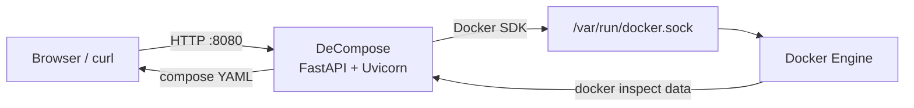

*Please :star: this repo if you find it useful*

<p align="left"><br>
<a href="https://www.paypal.com/paypalme/techblogil?locale.x=he_IL" target="_blank"></a>
</p>

# DeCompose

[](License)
[](https://github.com/t0mer/DeCompose/releases)
[](https://hub.docker.com/r/techblog/decompose)

DeCompose is a [FastAPI](https://fastapi.tiangolo.com/)-based web application that generates a Docker Compose
file from an existing container. It is for anyone who started containers with `docker run` (or lost the
original compose file) and wants a compose definition back. With a very simple UI you can generate a
compose file for any existing container, running or stopped: just navigate to the DeCompose address, pick a
container, and generate.

The DeCompose source code is available on GitHub at [https://github.com/t0mer/DeCompose](https://github.com/t0mer/DeCompose).

[](https://github.com/t0mer/DeCompose/blob/main/decompose.png?raw=true "DeCompose web UI")

## Table of Contents

- [Features](#features)
- [How It Works](#how-it-works)
- [Requirements](#requirements)
- [Installation](#installation)
- [Configuration](#configuration)
- [Usage](#usage)
- [API Reference](#api-reference)
- [Security Notes](#security-notes)
- [Troubleshooting](#troubleshooting)
- [Development](#development)
- [Contributing](#contributing)
- [Components and Libraries Used in DeCompose](#components-and-libraries-used-in-decompose)
- [License](#license)

## Features

- Lists every container on the host, running or stopped.
- Generates a Docker Compose YAML for the selected container and shows it in an online (Ace) editor.
- Downloads the generated compose file as `<container>-docker-compose.yaml`.
- REST API (`/api/containers`, `/api/generate`, `/api/download`) so you can automate generation, e.g. to
  back up your compose files remotely.
- Container names are validated on every endpoint; unknown containers return `404`.
- Security headers (CSP, `X-Frame-Options: DENY`, `X-Content-Type-Options: nosniff`, `Referrer-Policy`) on
  every response.
- Multi-arch Docker image (`linux/amd64`, `linux/arm64`, `linux/arm/v7`).

### Captured container settings

The generated service includes the following keys, taken from `docker inspect`. Keys whose value is empty,
`0`, `default`, or `no` are omitted.

| Compose key | Source |
|---|---|
| `container_name` | Container name |
| `image` | `Config.Image` |
| `command` | `Config.Cmd`, space-joined and written as a **single-item list** (see [Troubleshooting](#troubleshooting)) |
| `entrypoint` | `Config.Entrypoint` |
| `environment` | `Config.Env` (all variables, including those baked into the image) |
| `labels` | `Config.Labels` |
| `ports` | `HostConfig.PortBindings` (first binding per container port, as `[hostIp:]hostPort:containerPort/proto`) |
| `expose` | `Config.ExposedPorts`, only when no ports are bound |
| `volumes` | `HostConfig.Binds` (bind mounts and named volumes given with `-v`) |
| `volume_driver`, `volumes_from` | `HostConfig.VolumeDriver`, `HostConfig.VolumesFrom` |
| `networks` | Attached networks except the default `bridge` |
| `restart` | `HostConfig.RestartPolicy.Name` |
| `devices` | `HostConfig.Devices` (`host:container`) |
| `cap_add`, `cap_drop` | `HostConfig.CapAdd`, `HostConfig.CapDrop` |
| `privileged`, `read_only` | `HostConfig.Privileged`, `HostConfig.ReadonlyRootfs` |
| `security_opt`, `ulimits` | `HostConfig.SecurityOpt`, `HostConfig.Ulimits` |
| `dns`, `dns_search`, `extra_hosts`, `links` | Matching `HostConfig` fields |
| `logging` | `HostConfig.LogConfig` (driver and options) |
| `hostname`, `domainname`, `mac_address` | `Config.Hostname`, `Config.Domainname`, `NetworkSettings.MacAddress` |
| `user`, `working_dir`, `ipc`, `cgroup_parent` | Matching `Config` / `HostConfig` fields |
| `stdin_open`, `tty` | `Config.OpenStdin`, `Config.Tty` |

A top-level `networks:` section is always written: it is empty (`networks: {}`) when the container only uses
the default `bridge` network, and otherwise lists each attached network with `external: true` (or
`external: false` for Docker networks created as internal). A top-level `version` key is written as well.

## How It Works



DeCompose uses the Docker SDK for Python (`docker.from_env()`) to list containers and read their
`inspect` data, maps the relevant fields to Docker Compose keys (logic based on
[docker-autocompose](https://github.com/Red5d/docker-autocompose)), and renders the result as YAML.

## Requirements

- A Docker host, with access to the Docker Engine API (normally the `/var/run/docker.sock` socket mounted
  into the DeCompose container).
- For running from source: Python 3.12 (the version used by the Docker image) and the packages in
  [`decompose/requirements.txt`](decompose/requirements.txt).

## Installation

### Docker Compose

```yaml
services:
  decompose:
    image: techblog/decompose
    container_name: decompose
    restart: unless-stopped
    volumes:
      - /var/run/docker.sock:/var/run/docker.sock:ro
    ports:
      - "8080:8080"
```

The repository's [`docker-compose.yaml`](docker-compose.yaml) is a hardened variant of this example
(`read_only`, `cap_drop: ALL`, `no-new-privileges`, a `/tmp` tmpfs, and a healthcheck).
With an image built from the current source (which runs as the non-root `appuser`), that file as-is cannot
read the Docker socket; add `group_add: ["<docker socket gid>"]` to the service (see
[Troubleshooting](#troubleshooting)).

```bash
docker compose up -d
```

### Docker

```bash
docker run -d --name decompose \
  --restart unless-stopped \
  -p 8080:8080 \
  -v /var/run/docker.sock:/var/run/docker.sock:ro \
  techblog/decompose
```

### Image tags

| Registry | Image | Tags |
|---|---|---|
| Docker Hub | `techblog/decompose` | `latest`, and the version from [`VERSION`](VERSION) at release time |

Images are built for `linux/amd64`, `linux/arm64`, and `linux/arm/v7` when a GitHub release is published.

> **Note:** the newest image on Docker Hub is `1.0.0` (October 2021). The current source (`VERSION` 1.1.0:
> Python 3.12 base image, non-root user, input validation, security headers) has not been published yet.
> To run the current code, [build the image from source](#build-the-image-from-source).
<!-- TODO: verify — update this note once a 1.1.0 release/image is published. -->

### Build the image from source

```bash
git clone https://github.com/t0mer/DeCompose.git
cd DeCompose
docker build -t decompose .
```

Then use `decompose` instead of `techblog/decompose` in the examples above. The image built from the
current source runs as a non-root user (UID `10001`); see [Troubleshooting](#troubleshooting) for socket
permissions.

## Configuration

DeCompose has no configuration file and no application-specific environment variables.

| Setting | Value | Notes |
|---|---|---|
| Listen address / port | `0.0.0.0:8080` | Hardcoded; map a different host port with `-p <host>:8080`. |
| Docker connection | `/var/run/docker.sock` (default) | Uses `docker.from_env()`, so the standard Docker SDK variables `DOCKER_HOST`, `DOCKER_TLS_VERIFY`, and `DOCKER_CERT_PATH` are honored. |

## Usage

1. Open `http://<host>:8080`.
2. Select a container from the drop-down list (running and stopped containers are listed).
3. Click **Generate yaml** to show the compose file in the editor, where you can review and edit it.
4. Click **Download compose file** to download it as `<container>-docker-compose.yaml`.

Review the generated file before using it: it contains every environment variable of the container,
including ones inherited from the image, and may need cleanup; in particular, fix the `command` key (see
[Troubleshooting](#troubleshooting)).

## API Reference

All endpoints are `GET` and require no authentication.

| Method | Path | Parameters | Response |
|---|---|---|---|
| `GET` | `/` | — | Web UI (HTML). |
| `GET` | `/api/containers` | — | JSON array with the names of all containers (running and stopped). |
| `GET` | `/api/generate` | `cname` — container name or short ID | The compose YAML as a JSON-encoded string. |
| `GET` | `/api/download` | `cname` — container name or short ID | The compose YAML as a file download (`<cname>-docker-compose.yaml`). |

Errors: `400 Invalid container name` when `cname` is missing or contains characters other than
`[a-zA-Z0-9_.-]` (it must start with a letter or digit); `404 Container '<cname>' not found` when no
container matches.

The interactive Swagger UI and ReDoc pages are disabled; the OpenAPI schema is served at `/openapi.json`.

### Examples

```bash
# List containers
curl -s http://localhost:8080/api/containers
# ["decompose","nginx"]

# Print the compose YAML (the endpoint returns a JSON string, so decode it with jq)
curl -s "http://localhost:8080/api/generate?cname=nginx" | jq -r .

# Download the compose file (saved as nginx-docker-compose.yaml)
curl -sOJ "http://localhost:8080/api/download?cname=nginx"
```

Back up the compose files of all containers:

```bash
for c in $(curl -s http://localhost:8080/api/containers | jq -r '.[]'); do
  curl -s -o "$c-docker-compose.yaml" "http://localhost:8080/api/download?cname=$c"
done
```

## Security Notes

- **Docker socket access is root-equivalent.** Anyone who can talk to the Docker API can control the host.
  Mounting the socket with `:ro` only makes the socket file read-only; it does **not** restrict the API.
- **No authentication.** Every endpoint, including the one that returns container environments, is open.
  Do not expose DeCompose to the internet or untrusted networks; bind it to localhost
  (`-p 127.0.0.1:8080:8080`) or put it behind a reverse proxy with authentication.
- **Secrets appear in the output.** The generated YAML includes every environment variable of the
  container (database passwords, API keys, tokens). Treat generated and downloaded files as sensitive.
  Downloads are rendered in memory and are not written to disk inside the container.
- The API validates `cname`, and every response (UI, API, and static files) carries security headers
  (Content-Security-Policy, `X-Frame-Options`, `X-Content-Type-Options`, `Referrer-Policy`).

## Troubleshooting

- **The container list is empty or requests fail with a Docker permission error.** The image built from the
  current source runs as UID `10001`, which usually cannot read `/var/run/docker.sock` (owned by
  `root:docker`, mode `660`). Give the container the socket's group:

  ```bash
  docker run ... --group-add "$(stat -c %g /var/run/docker.sock)" ...
  ```

  or add `group_add: ["<gid>"]` to the compose service.
  <!-- TODO: verify — confirm on a host with the 1.1.0 image. -->
- **`404 Container '...' not found`.** Use the exact container name (as shown by `docker ps -a`) or its
  short ID.
- **`400 Invalid container name`.** The `cname` parameter is missing or contains characters outside
  `[a-zA-Z0-9_.-]`.
- **The generated `command` does not work.** `command` is written as a single-item list holding the whole
  space-joined command (for example `command: ['nginx -g daemon off;']`). In list (exec) form Docker treats that
  whole string as the executable name, so the service fails to start. Rewrite it in the generated file as a
  plain string or as a list with one item per argument.
- **Docker Compose rejects boolean values such as `privileged: yes`.** The YAML writer (pyaml) may output
  booleans as `yes`/`no`; Docker Compose v2 may not accept these. Replace them with `true`/`false`.
  <!-- TODO: verify — confirm pyaml's boolean output and Compose v2's behavior. -->
- **Docker Compose warns that `version` is obsolete.** The generated file includes a top-level `version`
  key; Docker Compose v2 ignores it, so you can delete it.

## Development

Project layout:

```
decompose/
  decompose.py        # FastAPI app and compose generation logic
  requirements.txt    # Python dependencies
  templates/index.html
  dist/               # Static assets (Bootstrap, Select2, jQuery, Ace, app.js)
Dockerfile
docker-compose.yaml
VERSION               # Image version used by the release workflow
```

Run locally (the app loads `templates/` and `dist/` relative to the working directory, so run it from
`decompose/`):

```bash
cd decompose
python3 -m venv .venv && . .venv/bin/activate
pip install -r requirements.txt
python3 decompose.py   # http://localhost:8080
```

Your user needs access to the Docker socket (or set `DOCKER_HOST`).

GitHub Actions workflows:

- [`main.yml`](.github/workflows/main.yml) — on a published GitHub release, builds and pushes
  `techblog/decompose:latest` and `techblog/decompose:<VERSION>` to Docker Hub.
- [`publish-ghcr.yml`](.github/workflows/publish-ghcr.yml) — manual build and push to
  `ghcr.io/t0mer/decompose`.
- [`docker-image.yml`](.github/workflows/docker-image.yml) — manual build and push to a private JFrog
  Container Registry.

## Contributing

Issues and pull requests are welcome on [GitHub](https://github.com/t0mer/DeCompose). Please keep pull
requests focused on one change.

## Components and Libraries Used in DeCompose

* [docker-autocompose](https://github.com/Red5d/docker-autocompose)
* [FastAPI](https://fastapi.tiangolo.com/)
* [Docker SDK for Python](https://docker-py.readthedocs.io/)
* [Bootstrap](https://getbootstrap.com/docs/5.0/getting-started/introduction/)
* [Select2](https://select2.org/)
* [jQuery-ace](https://cheef.github.io/jquery-ace/)

## License

DeCompose is licensed under the [Apache License 2.0](License).
